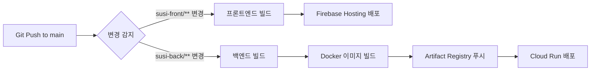

# 배포 가이드

## 프론트엔드 배포 (Firebase Hosting)

### 1. Firebase 프로젝트 설정

```bash
cd susi-front
npm install -g firebase-tools
firebase login
firebase init hosting
```

### 2. 빌드 및 배포

```bash
npm run build
firebase deploy
```

### 배포 URL
- 스테이징: https://susi-staging.web.app
- 프로덕션: https://susi.geobukschool.com

## 백엔드 배포 (Google Cloud Run)

### 1. Dockerfile 생성

`susi-back/Dockerfile`:

```dockerfile
FROM node:20-alpine

WORKDIR /app

COPY package*.json ./
RUN npm ci --only=production

COPY . .
RUN npm run build

EXPOSE 8080
CMD ["npm", "run", "start:prod"]
```

### 2. Cloud Run 배포

```bash
cd susi-back

# Cloud Run에 배포
gcloud run deploy susi-backend \
  --source . \
  --region asia-northeast3 \
  --platform managed \
  --allow-unauthenticated \
  --memory 1Gi \
  --cpu 1 \
  --port 8080
```

### 3. 환경 변수 설정

Cloud Run 콘솔에서 환경 변수를 설정하세요:
- DB_HOST
- DB_USER
- DB_PASSWORD
- JWT_SECRET
- 등...

## 데이터베이스 (Cloud SQL)

### Hubs와 동일한 Cloud SQL 인스턴스 사용

수시 프로젝트는 Hubs와 동일한 데이터베이스를 사용합니다.

연결 설정:
```env
DB_HOST=/cloudsql/project-id:region:instance-name
```

## CI/CD (GitHub Actions) ✅

GitHub Actions를 통한 자동 배포가 설정되어 있습니다.

### 워크플로우 파일
- `.github/workflows/deploy-frontend.yml`: 프론트엔드 자동 배포
- `.github/workflows/deploy-backend.yml`: 백엔드 자동 배포
- `.github/workflows/deploy-all.yml`: 전체 자동 배포 (변경 감지)

### 배포 트리거
- `main` 브랜치에 푸시 시 자동 배포
- 수동 배포: GitHub Actions 탭에서 "Run workflow" 실행

### 필요한 GitHub Secrets
1. **FIREBASE_SERVICE_ACCOUNT**: Firebase 배포용 서비스 계정 키
2. **GCP_SA_KEY**: Cloud Run 배포용 GCP 서비스 계정 키

자세한 설정 방법: [.github/GITHUB_SECRETS_SETUP.md](.github/GITHUB_SECRETS_SETUP.md)

### 배포 구성

#### 프론트엔드 (Firebase Hosting)
- 프로젝트: ts-front-479305
- 타겟: susi
- 도메인: https://susi.turtleschool.com

#### 백엔드 (Cloud Run)
- 프로젝트: ts-back-nest-479305
- 서비스: susi-backend
- 리전: asia-northeast3
- 컨테이너 레지스트리: Artifact Registry
- 이미지: asia-northeast3-docker.pkg.dev/ts-back-nest-479305/susi/backend

### 배포 프로세스



## 모니터링

- **프론트엔드**: Firebase Hosting 콘솔
- **백엔드**: Cloud Run 콘솔, Cloud Logging
- **에러 트래킹**: Sentry (선택사항)

---

**배포 전 체크리스트**:
- [ ] 환경 변수 설정 확인
- [ ] JWT_SECRET이 Hubs와 동일한지 확인
- [ ] 데이터베이스 연결 테스트
- [ ] API 엔드포인트 테스트
- [ ] CORS 설정 확인


