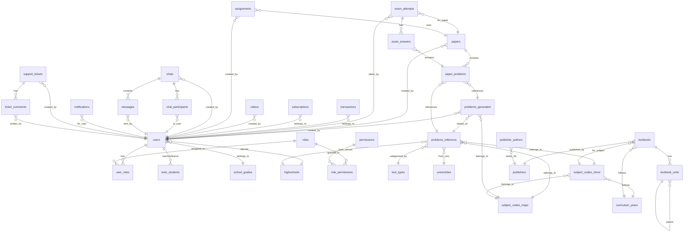

# 문제은행 플랫폼 ERD (Entity Relationship Diagram)

## 개요

- **총 테이블 수**: 28개
- **데이터베이스**: MySQL 8.0+
- **문자셋**: utf8mb4

---

## 테이블 관계도 (Mermaid)



---

## 테이블 카테고리

### 1. 기초 코드 테이블 (Lookup Tables)

| 테이블명 | 설명 | 주요 컬럼 |
|---------|------|----------|
| `school_grades` | 학년 코드 | grade_id (PK), grade_name, school_level |
| `curriculum_years` | 교육과정 연도 | curi_year_id (PK), curi_year_name |
| `subject_codes_major` | 과목 대분류 | subject_major_id (PK), subject_area, subject_code |
| `subject_codes_minor` | 과목 소분류 | subject_minor_id (PK), curi_year_id (FK), subject_name |
| `test_types` | 시험 유형 | test_type_id (PK), test_type_name |
| `test_sources` | 시험 출처 | source_id (PK), test_type_id (FK), source_code |
| `highschools` | 고등학교 정보 | school_id (PK), school_name, region_city |
| `universities` | 대학교 정보 | univ_id (PK), univ_name, region |
| `publishers` | 출판사 | publisher_id (PK), publisher_name |
| `publisher_authors` | 저자 | author_id (PK), publisher_id (FK), author_name |

### 2. 역할/권한 테이블 (RBAC)

| 테이블명 | 설명 | 주요 컬럼 |
|---------|------|----------|
| `roles` | 역할 정의 | role_id (PK), role_name, role_scope |
| `permissions` | 권한 정의 | perm_id (PK), perm_name, category |
| `role_permissions` | 역할-권한 매핑 | role_id (PK, FK), perm_id (PK, FK) |

### 3. 사용자 테이블

| 테이블명 | 설명 | 주요 컬럼 |
|---------|------|----------|
| `users` | 통합 사용자 | user_id (PK), email, user_type, school_id (FK) |
| `user_roles` | 사용자-역할 매핑 | user_id (PK, FK), role_id (PK, FK) |
| `tutor_students` | 교사-학생 관계 | tutor_id (FK), student_id (FK) |

### 4. 문제 테이블

| 테이블명 | 설명 | 주요 컬럼 |
|---------|------|----------|
| `problems_reference` | 기출문제 | problem_id (PK), test_type_id (FK), exam_type |
| `problems_generated` | AI 생성 문제 | problem_id (PK), creator_id (FK), base_problem_id (FK) |

### 5. 시험지/응시 테이블

| 테이블명 | 설명 | 주요 컬럼 |
|---------|------|----------|
| `papers` | 시험지 | paper_id (PK), creator_id (FK), title |
| `paper_problems` | 시험지-문제 매핑 | paper_id (FK), problem_id |
| `exam_attempts` | 시험 응시 | attempt_id (PK), student_id (FK), paper_id (FK) |
| `exam_answers` | 문제별 답안 | attempt_id (FK), paper_problem_id (FK) |

### 6. 결제/구독 테이블

| 테이블명 | 설명 | 주요 컬럼 |
|---------|------|----------|
| `transactions` | 거래 내역 | transaction_id (PK), user_id (FK), amount |
| `subscriptions` | 구독 | subscription_id (PK), user_id (FK), plan_type |

### 7. 학습 콘텐츠 테이블

| 테이블명 | 설명 | 주요 컬럼 |
|---------|------|----------|
| `videos` | 동영상 | video_id (PK), creator_id (FK), title |
| `assignments` | 과제 | assignment_id (PK), creator_id (FK), paper_id (FK) |
| `textbooks` | 교재 | textbook_id (PK), subject_minor_id (FK) |
| `textbook_units` | 교재 단원 | unit_id (PK), textbook_id (FK), parent_unit_id (FK) |

### 8. 커뮤니케이션 테이블

| 테이블명 | 설명 | 주요 컬럼 |
|---------|------|----------|
| `chats` | 채팅방 | chat_id (PK), chat_type, created_by (FK) |
| `chat_participants` | 채팅 참여자 | chat_id (PK, FK), user_id (PK, FK) |
| `messages` | 메시지 | message_id (PK), chat_id (FK), sender_id (FK) |
| `notifications` | 알림 | notification_id (PK), user_id (FK) |

### 9. 고객지원 테이블

| 테이블명 | 설명 | 주요 컬럼 |
|---------|------|----------|
| `support_tickets` | 지원 티켓 | ticket_id (PK), user_id (FK), status |
| `ticket_comments` | 티켓 코멘트 | comment_id (PK), ticket_id (FK) |

---

## 주요 관계 설명

### 사용자 역할 시스템 (RBAC)
```
users (1) ─────< user_roles >───── (N) roles
                    │
                    │
roles (1) ─────< role_permissions >───── (N) permissions
```

- 한 사용자는 여러 역할을 가질 수 있음
- 한 역할은 여러 권한을 가질 수 있음
- 권한은 `entity:action` 형식 (예: `problems:create`)

### 문제 구조
```
problems_reference (기출문제)
        │
        └──── problems_generated (AI 생성문제, 기출문제 기반 변형 가능)

problems_reference
        │
        ├── test_types (내신/수능/모의/논술/심층면접/특목자사)
        ├── subject_codes_major (국어/수학/영어/...)
        ├── subject_codes_minor (세부 과목)
        ├── highschools (내신/특목자사 출처)
        └── universities (논술/심층면접 출처)
```

### 시험지 구조
```
papers (시험지)
    │
    └──< paper_problems >──── problems_reference / problems_generated
            │
            └──< exam_answers >──── exam_attempts (응시)
                                        │
                                        └── users (학생)
```

### 교재/단원 구조 (Self-referencing)
```
textbooks
    │
    └──< textbook_units (대단원)
              │
              └──< textbook_units (중단원)
                        │
                        └──< textbook_units (소단원)
```

---

## 사용자 유형 (user_type)

| 코드 | 역할명 | 설명 |
|-----|-------|------|
| ST | 학생 | 학습자 |
| PA | 학부모 | 자녀 학습 관리 |
| TE | 학습관리선생님 | 학습 지도 및 관리 |
| ED | 에디터 | 문제 편집 및 검수 |
| CE | 수석에디터 | 에디터 관리, 최종 검수 |
| AD | 관리자 | 시스템 관리 |
| SA | 영업 | 영업 담당 |
| AG | 대행사 | 대행사 |
| AC | 학원 | 학원 관리자 |
| CS | 고객서비스 | 고객 지원 |

---

## ID 형식 규칙

### 문제 ID (problems_reference)

| 시험유형 | 형식 | 예시 | 설명 |
|---------|------|-----|------|
| 내신(NS) | NS+학교코드(5)+과목(2)+년도(2)+학년(1)+학기(1)+시기(1) | NSH0001M12411M | 14자리 |
| 수능(SN) | SN+과목코드(2)+년도(4) | SNM32003 | 8자리 |
| 모의(ME) | ME+과목코드(2)+년도(2)+학년(1)+월(2) | MEM124306 | 9자리 |
| 논술(NO) | NS+대학코드(4)+과목(2)+년도(2)+시기(1) | NSU001M1240 | 11자리 |
| 심층면접(SM) | SM+대학코드(4)+과목(2)+년도(2)+시기(1) | SMU001M1230 | 11자리 |
| 특목자사(TJ) | TJ+학교코드(5)+과목(2)+년도(2)+시기(1) | TJH0012M12440 | 12자리 |

### 사용자 ID
- 학생: `ST` + serial (예: ST1, ST2, ...)
- 학부모: `PA` + 자녀학생ID (예: PAST1)
- 교사: `TE` + serial (예: TE1, TE2, ...)

---

## 인덱스 전략

### 주요 인덱스

```sql
-- 문제 검색 최적화
INDEX idx_test_type (test_type_id)
INDEX idx_subject (subject_major_id, subject_minor_id)
INDEX idx_year (year)
INDEX idx_difficulty (difficulty)
FULLTEXT INDEX ft_problem_text (problem_text, solution)

-- 사용자 검색 최적화
INDEX idx_user_type (user_type)
INDEX idx_email (email)
INDEX idx_school (school_id)

-- 시험 응시 조회 최적화
INDEX idx_student (student_id)
INDEX idx_paper (paper_id)
INDEX idx_status (status)
```

---

## 뷰 목록

| 뷰 이름 | 설명 |
|--------|------|
| `v_student_details` | 학생 상세 정보 (학교명, 학년 등 조인) |
| `v_problem_stats` | 과목/유형/난이도별 문제 통계 |

---

## 데이터 추정량 (엑셀 기반)

| 테이블 | 예상 레코드 수 |
|-------|--------------|
| users | 10,000+ |
| problems_reference | 100,000+ |
| problems_generated | 50,000+ |
| highschools | 1,879 |
| universities | 867 |
| subject_codes_minor | 90 |
